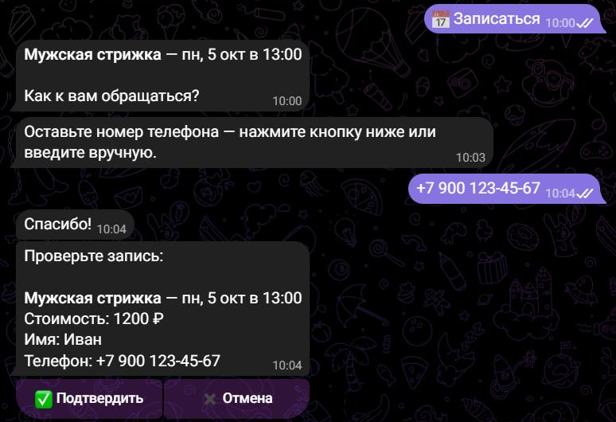

# Telegram-бот онлайн-записи для барбершопа / салона

Бот на Python (aiogram 3), через который клиенты сами записываются на услуги: выбирают услугу, день и свободное время, оставляют контакты — а администратор сразу получает уведомление.

Подходит для барбершопов, салонов красоты, мастеров маникюра, репетиторов, автомоек — любого бизнеса с записью по времени. Услуги, цены и рабочие часы настраиваются в одном файле.

## Возможности

**Для клиента**
- 📅 Запись в несколько нажатий: услуга → день → время → имя → телефон → подтверждение.
- Показываются **только свободные слоты**: с учётом длительности услуги, уже занятого времени и конца рабочего дня.
- 📱 Номер телефона — одной кнопкой «Отправить мой номер» или вручную (с проверкой формата).
- 🗂 «Мои записи» — список предстоящих визитов и отмена в один клик.
- ⏰ Автоматическое напоминание за N часов до визита.

**Для администратора**
- 🆕 Мгновенное уведомление о новой записи и об отмене.
- `/today`, `/tomorrow` — расписание на день с контактами клиентов и суммой.
- `/cancel_booking N` — отмена записи, клиент получает сообщение.

**Надёжность**
- Защита от двойной записи: если два клиента одновременно выбрали одно время, второй получит вежливый отказ (блокирующая транзакция SQLite).
- Админ-команды доступны только Telegram ID из настроек.
- Покрыто тестами: логика слотов, база данных и **сквозной сценарий записи** через диспетчер aiogram без обращения к сети.

## Скриншоты

| 1. Выбор услуги | 2. Свободное время |
|---|---|
|  |  |
| **3. Контакты и подтверждение** | **4. Запись создана + уведомление админу** |
|  |  |

**Админ-команда `/tomorrow`** — расписание на завтра с контактами и суммой:


## Установка и запуск

Нужен Python 3.10+.

```bash
git clone https://github.com/Krasatim/telegram-booking-bot.git
cd telegram-booking-bot
python -m venv .venv
.venv\Scripts\activate          # Windows
# source .venv/bin/activate     # macOS / Linux
pip install -r requirements.txt
```

1. Создайте бота у [@BotFather](https://t.me/BotFather) командой `/newbot` и скопируйте токен.
2. Узнайте свой Telegram ID, например у [@userinfobot](https://t.me/userinfobot).
3. Скопируйте `.env.example` в `.env` и впишите токен и ID:

```env
BOT_TOKEN=123456:ABC...
ADMIN_IDS=123456789
```

4. Запустите:

```bash
python -m bot
```

На Windows можно просто дважды щёлкнуть по `run_bot.bat`. Бот работает, пока открыто окно; остановить — закрыть окно или нажать Ctrl+C.

## Настройка под своё заведение

Всё в файле [`bot/config.py`](bot/config.py):

```python
SERVICES = {...}        # услуги: название, длительность (мин), цена
WORK_START_HOUR = 10    # начало рабочего дня
WORK_END_HOUR = 20      # к этому времени услуга должна закончиться
SLOT_STEP_MIN = 30      # шаг сетки записи
DAYS_AHEAD = 7          # на сколько дней вперёд открыта запись
```

В `.env` дополнительно: `TIMEZONE` (по умолчанию `Europe/Moscow`), `REMIND_BEFORE_HOURS` (по умолчанию 2), `DB_PATH`.

## Тесты

```bash
pip install -r requirements-dev.txt
pytest
```

## Структура

```
bot/
├── __main__.py        # запуск, сборка диспетчера, фоновые напоминания
├── config.py          # услуги, рабочее время, настройки из .env
├── slots.py           # расчёт свободных слотов (чистая логика)
├── db.py              # SQLite: записи, защита от двойного бронирования
├── keyboards.py       # клавиатуры и callback-данные
├── reminders.py       # напоминания клиентам
└── handlers/
    ├── client.py      # сценарий записи для клиента
    └── admin.py       # команды администратора
tests/                 # pytest: слоты, БД, сквозной сценарий
```

## Стек

Python · aiogram 3 · aiosqlite · pytest

---

Нужен похожий бот для вашего бизнеса? Пишите на Kwork.
